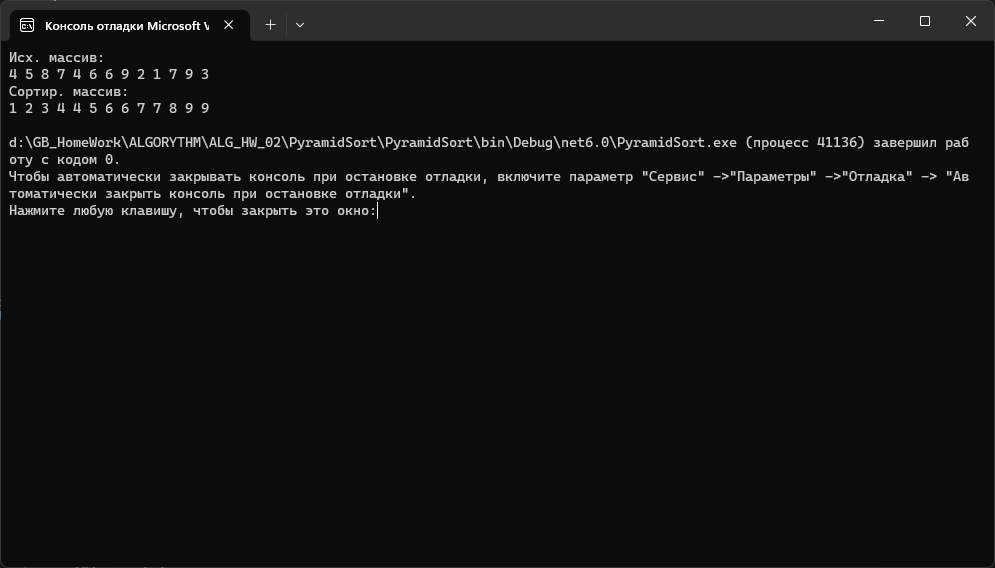

# Алгоритмы и структуры данных

## Структуры данных. Массивы. Алгоритмы массивов.

Реализовать алгоритм пирамидальной сортировки (сортировка кучей).

Общая идея пирамидальной сортировки заключается в том, что сначала строится пирамида из элементов исходного массива, а затем осуществляется сортировка элементов.

### 1 этап 

Построение пирамиды. Определяем правую часть дерева, начиная с n/2-1 (нижний уровень дерева). Берем элемент левее этой части массива и просеиваем его сквозь пирамиду по пути, где находятся меньшие его элементы, которые одновременно поднимаются вверх; из двух возможных путей выбираете путь через меньший элемент.

### 2 этап 

Сортировка на построенной пирамиде. Берем последний элемент массива в качестве текущего. Меняем верхний (наименьший) элемент массива и текущий местами. Текущий элемент (он теперь верхний) просеиваем сквозь n-1 элементную пирамиду. Затем берем предпоследний элемент и т.д.

### Скриншот выполнения

